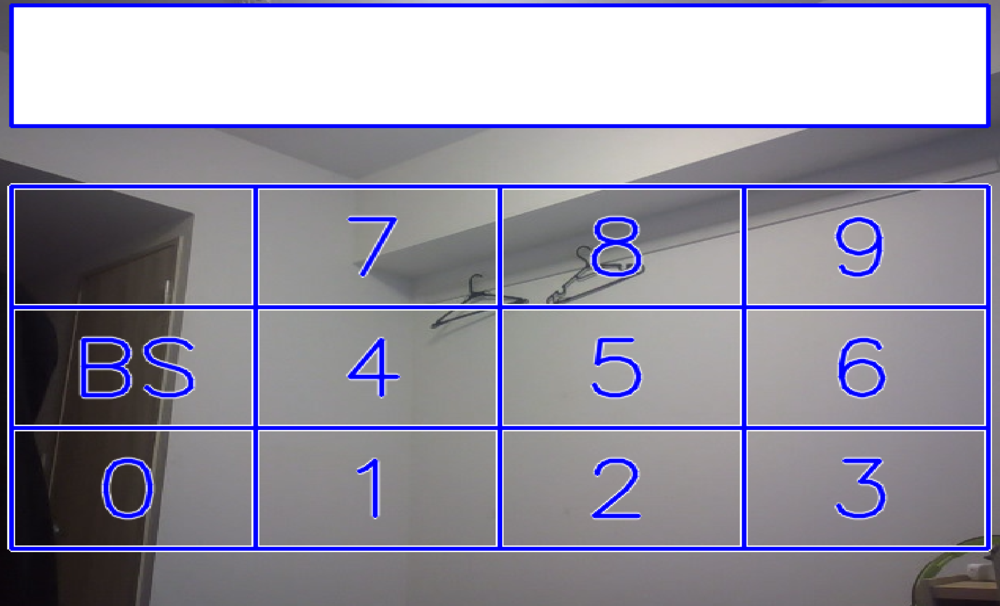
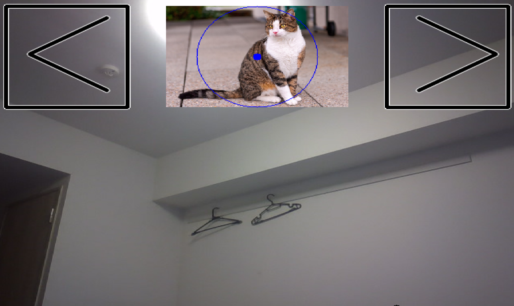

# MediaPipeを用いた非接触UI

このリポジトリには、Google MediaPipeを用いたサンプルコードと2つの非接触UIの実装が含まれています。これらのプロジェクトは、Webカメラで検出された手のジェスチャーを使用してコンピューターインターフェースと対話することを可能にします。

## 必要な環境

- Python 3.7以上
- OpenCV
- MediaPipe
- NumPy

## インストール方法

1. リポジトリをクローンします:
    ```sh
    git clone https://github.com/yourusername/Non-Contact-UI-MediaPipe.git
    ```

2. プロジェクトディレクトリに移動します:
    ```sh
    cd Non-Contact-UI-MediaPipe
    ```

3. 必要なパッケージをインストールします:
    ```sh
    pip install -r requirements.txt
    ```

4. `requirements.txt`ファイルには以下が含まれます:
    ```
    opencv-python
    mediapipe
    numpy
    ```

## 実行方法

サンプルコードを実行するには、以下を実行します:

```sh
python Hands_sample.py
```

非接触のテンキー入力UIを実行するには、以下を実行します:

```sh
python Hands_TenKey.py
```

非接触の画像移動・変更UIを実行するには、以下を実行します:

```sh
python Hands_img_move_chage.py
```

実行前にWebカメラが正しく接続されていることを確認してください。

## ファイルの説明

- `Hands_sample.py`: MediaPipeを用いた手の追跡の基本的な例。
- `Hands_TenKey.py`: 手のジェスチャーを使用して非接触のテンキーパッドを実装。
- `Hands_img_move_chage.py`: 手のジェスチャーを使用して画像を移動・変更する非接触UIを実装。

### Hands_TenKey.pyの使い方



`Hands_TenKey.py`は、手のジェスチャーを使用して非接触のテンキーパッドを実装しています。実行するには以下を実行してください：

```sh
python Hands_TenKey.py
```

- **テンキーパッドの使い方**：
  - 指先をテンキーパッドの上に移動し、「ピンチ」動作（親指と人差し指を近づける動作）を行うことで数字を入力できます。
  - バックスペースは「BS」ボタンを押すことで利用可能です。

### Hands_img_move_change.pyの使い方



`Hands_img_move_change.py`は、手のジェスチャーを使用して画像を移動・変更する非接触UIを実装しています。実行するには以下を実行してください：

```sh
python Hands_img_move_chage.py
```

- **画像移動・変更の使い方**：
　- 画像上で「掴む(グー)」動作をすることで、画像を移動させることができます。
  - 両手で画像を「ピンチ」することで、画像を選択・移動・拡大縮小できます。
  - 画像の左右にある``＜``、``＞``上で「ピンチ」することで画像を変更することができます。
  - 「チョキ」でリセットを行うことができます。